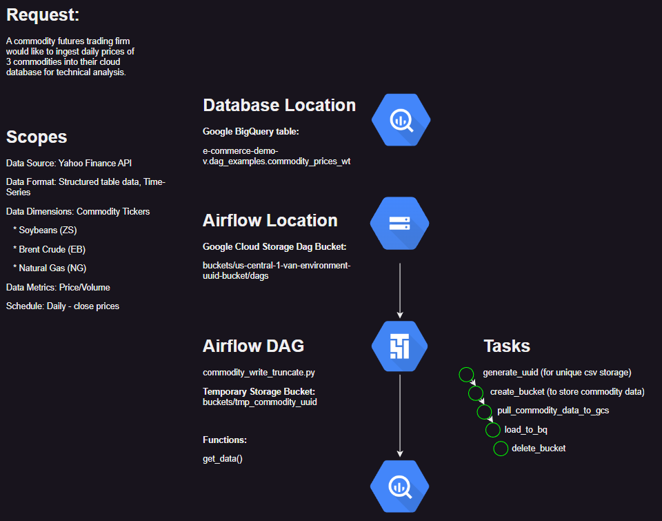
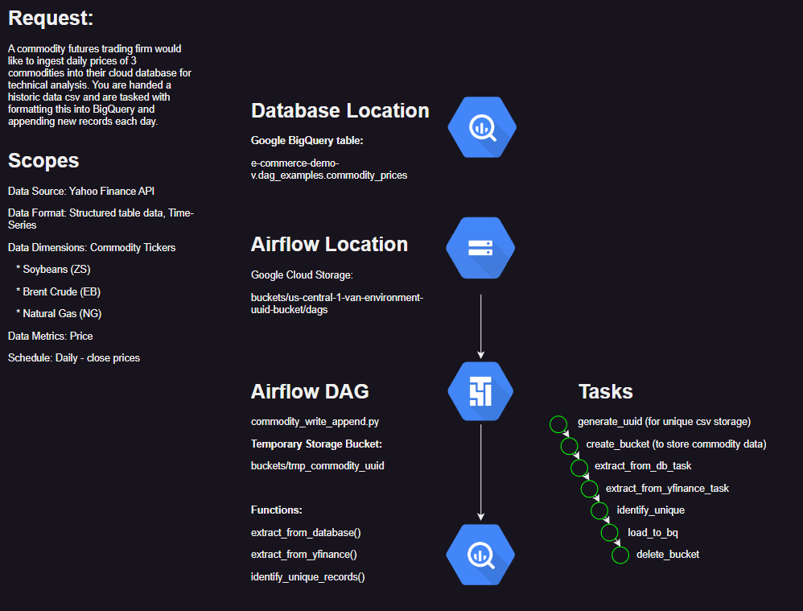
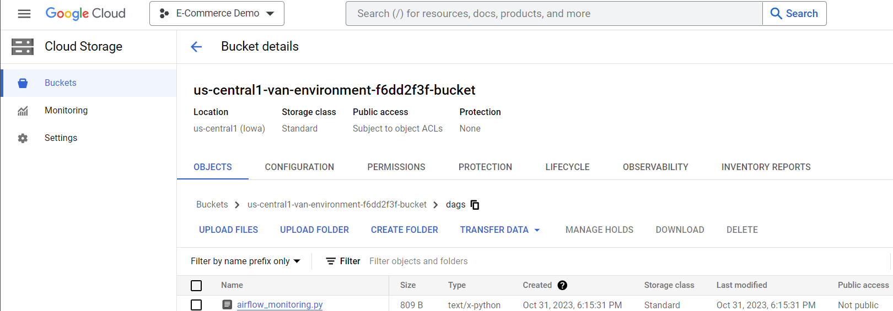

# data_engineer_api_pipeline

## Orchestrating API Data Into BigQuery Using Airflow [The Analyst's Guide to Data Engineering]

[Medium Article](https://medium.com/@vanaltrades/orchestrating-api-data-into-bigquery-using-airflow-the-analysts-guide-to-data-engineering-0bd6733b5d91)

Analysts rarely feel satisfied with their reporting suite or available data.

All too often, analysts will brainstorm ways to improve data quality and bring external data into their data warehouse for advanced analysis or ideation.

However, when companies like Google or Bloomberg do not provide an automated data integration into your data warehouse, the task of ingesting new data sources seems too complex to complete as an analyst.

That's because the job of orchestrating data movement from external sources towards internal datasets falls under the domain expertise of Data Engineers.

Data Engineers play a key role in unlocking novel and creative insights for analysts. But for analysts to leverage new data, they must have a close relationship to Data Engineers, prioritize and explain value in request tickets, and even then, analysts may have to wait weeks for any of their requested data to appear in production.

This article will explain and demonstrate exactly how Data Engineers use Google's cloud managed Cloud Composer service to ingest data from an API, format the data to specifications, load the data to a BigQuery database table, and schedule the process to run daily.

By reading and applying this article's lessons, analysts will be introduced to a world of possibility. Analysts will learn how orchestrating Python functions and Airflow operators can remove years of work from their backlog while relying upon automated processing.

The Scenario:

Imagine you are an analyst at a commodities trading firm. You and your team have been manually downloading commodity prices from a website and performing technical analysis to identify buy and sell signals. Spending hours each day on redoing tasks like downloading csvs, appending csv data to a spreadsheet, writing spreadsheet functions, and dealing with several 'sources of truth' from different team members, you think there has to be a more automated and efficient way to accomplish this work. 

You've spoken with the firm's Data Engineering team and they explain that they use a cloud managed Airflow instance on GCP to orchestrate data ingestion. They mention a first step would be to ingest the data but incorporating the technical analysis algorithm will take longer to review and deploy. But their backlog of tickets extends 3 months and you want this automated now. 

You chose to tackle this first data ingestion task yourself, to save yourself time and learn new and beneficial skills to build upon.

This article will explain two variations of a similar request to demonstrate how different scopes (requirements planned ahead of time) can result in two completely different orchestrations.

1. A commodity futures trading firm would like to ingest daily prices of 3 commodities into their cloud database for technical analysis.
2. A commodity futures trading firm would like to ingest daily prices of 3 commodities into their cloud database for technical analysis. You are handed a historic data csv and are tasked with formatting this into BigQuery and appending new records each day.

Key Objective:

Deploy an Airflow data API ingestion DAG (directed acyclic graph) to Google Cloud Platform that loads commodity prices to a BigQuery database.

Primary Benefit:

Learn the basics of Airflow orchestration to schedule automated data ingestion tasks.

Secondary Benefit:

Introduction to Airflow operators that will allow you to deploy orchestrated algorithmic tasks in the future.

Visualizing and planning a solution.

Analysts will learn how to save time when explaining requests to Data Engineers.

General notes:

This tutorial will focus primarily on setting up analysts with a functional implementation to apply to their own priorities. For more details on the structure of Airflow, tutorials can be found online. 

A simplified explanation of an Airflow's DAG structure is the inclusion of Operators that are sequentially ordered. Task operators in Apache Airflow are specialized components that define and execute individual tasks within a workflow. They encapsulate the logic and parameters needed to run a specific task, allowing you to create complex, orchestrated workflows by chaining these task operators together. 

In this example, Google Cloud Platform is used to host Airflow, so we will be using GCP Operators in tandem with Python Operators (which allow developers to write Python functions and pass their logic to an operator).

## Repository Structure

This repository does not act as a Python package. Instead, it acts as a reference for storing your DAG code that will be uploaded to Google's Cloud Composer. Development Operations (DevOps) specializes in deploying code to production and requires more expertise. For now, understand that this example demonstrates a functional approach, but managing a deployable code base would be required to scale ingestion operations efficiently.

```
data_engineer_api_pipeline
│   .gitattributes
│   .gitignore
│   LICENSE
│
└───src
    ├───commodity_prices
    │   │   create_bq_historic_table.py
    │   │   __init__.py
    │   │
    │   └───dags
    │           dag_commodity_write_truncate.drawio
    │           dag_commodity_write_truncate.py
    │           __init__.py
    └───utils
            gcp_utils.py
            __init__.py
```

Because the idea is to create a commodity price ingestion script, within the `/src` folder, I included a subdirectory called `/commodity_prices`. In this article, one DAG will be covered, but there will inevitably be room to add more, so I have created a folder where `/dags` can be stored.

Within the `/dags` folder exists Python files that will be uploaded to Cloud Composer as well as `.drawio` flow chart files to visually illustrate the process of each DAG. Visualizing the scopes, process, and tasks that should occur in a scheduled script is always a good idea.

In the event a csv with historic information and formatting is provided, I have included a `create_bq_historic_table.py` file that can be run to upload the data to BigQuery. That process will not be covered, but is available for reference.

## From Idea to Implementation: Walking Through the Script's Process

### Aproach #1: Request API and Load to BQ

You want your process to cover the folling scopes:

* dimensions: dates and commodity tickers
    * date range: 2022-01-01 thru today's date
    * commodity tickers: Soybeans (ZS), Brent Crude Oil (EB), and Natural Gas (NG)
* metrics: prices and volume
    * 'Adj_Close', 'Close', 'High', 'Low', 'Open', 'Volume'

You want to accomplish the following tasks in the following order:

1. Collect historic commodity prices for the commodities in scope
2. Load the collected data into a new BigQuery table

That seems simple enough. But be sure to define where the data will store in between steps, as you should store in a cloud file system in between the load to the structured database. And how can you be sure that you don't append daily data to the table each day which would compound duplicates? That will be speficied in the DAGs BigQuery operator and will be covered later on.

Taking into account these scopes and process plans, you should visualize this planned process so you and your stakeholders can quickly and intuitively understand the end to end request. 



### Approach #2: Backfill CSV, Request API, Load new to BigQuery

For task 2, the scopes look similiar:

* dimensions: dates and commodity tickers
    * date range: 2022-01-01 thru today's date
    * commodity tickers: Soybeans (ZS), Brent Crude Oil (EB), and Natural Gas (NG)
* metrics: prices and volume
    * 'Adj_Close', 'Close', 'High', 'Low', 'Open', 'Volume'

But the steps to complete will vary based on the csv backfill task. Steps may look like:

1. Load the historic csv file to a new table
2. Collect historic commodity prices for the commodities in scope
3. Compare the existing table with the new data and drop duplicates
4. Load the new records into a new BigQuery table



## Configuring a GCP Project For Cloud Composer (Airflow)

Now onto setting up your Cloud Composer environment. Many tutorial resources exist on this step, so instruction is light.


And you've made your environment which links to an Airflow UI to explore your DAGs, logs, and more. 


The environment page also links to the Google Cloud Storage bucket where you will upload dags.


And because you plan to use the yfinance Python package, navigate to the PYPI Packages tab where you can install the yfinance method to this environment.


## Approach #1 - WRITE TRUNCATE

In approach one, we just want to get an APIs data and overwrite a table with the new data each day. 

This file is called `dag_commodity_write_truncate.py` because our BigQuery `write_disposition` value will be set to `WRITE_TRUNCATE` to avoid duplicating values and appending each day.

Let's breakdown the steps in `dag_commodity_write_truncate.py`:

Dag Structure:

1. Importing packages
2. Defining variables such as table locations and dag arguments
3. Defining Python functions that will be run in a PythonOperator task later on
4. Define the DAG's context manager which encapsulates the tasks and their dependencies
5. Define the tasks to run
6. Define the order of dependencies (how the tasks should chain together)

Let's breakdown the DAG's code in `dag_commodity_write_truncate.py`:

1. Importing packages

Simply import packages we will require. If a package is not included in the Airflow environment (yfinance), be sure to install the dependency via the Cloud Compser UI or command line.

```
from airflow import DAG
from airflow.operators.python_operator import PythonOperator
from airflow.providers.google.cloud.transfers.gcs_to_bigquery import GCSToBigQueryOperator
...
import yfinance as yf
```

2. Defining variables such as table locations and dag arguments

Next, the BigQuery location is defined so tasks and functions can reference it. We also define arguments for our DAG.

```
PROJECT_ID="e-commerce-demo-v"
STAGING_DATASET = "dag_examples"
TABLE = "commodity_prices_wt"
LOCATION = "us-central1"

default_args = {
    'owner': 'VanAltrades',
    'depends_on_past': False,
    'email_on_failure': False,
    'email_on_retry': False,
    'retries': 1,
    'start_date':  days_ago(1),
    'retry_delay': timedelta(minutes=5),
}
```

3. Defining Python functions that will be run in a PythonOperator task later on

Next, I defined a function that will (1) get required commodity data from the yfinance API and (2) store the output to GCS. Be sure to properly format the data to match the schema you want in the BigQuery table here.

```
def get_data():
    # Tickers list for data extraction from yahoo finance
    tickers = ['BZ', 'EB', 'NG']

    # Set start and end date ranges
    today = dt.datetime.now()
    start = dt.datetime(2022, 1, 1,)
    end = dt.date(today.year, today.month, today.day)

    # API call to download data from yahoo finance
    d = yf.download(tickers=tickers, start=start, end=end, interval='1d',)

    # format multi-column index dataframe to single column row
    data = d.stack(level=1)
    data = data.reset_index()

    # format table
    data.columns = ['Date','Ticker','Adj_Close', 'Close', 'High', 'Low', 'Open', 'Volume'] # rename columns to follow BigQuery specs
    data = data.dropna(subset=['Adj_Close', 'Close', 'High', 'Low', 'Open', 'Volume'], how="all") # drop na records
    data = data.sort_values(by="Date",ascending=False) # sort by date desc per preference
    data = data[['Date','Ticker','Adj_Close', 'Close', 'High', 'Low', 'Open', 'Volume']]

    # Convert the data to CSV and encode 
    data = data.to_csv(index=False).encode()

    # Create a storage client
    storage_client = storage.Client()

    # Get a list of all buckets
    buckets = list(storage_client.list_buckets())

    # Filter the list of buckets to only include those with the desired prefix
    buckets_with_prefix = [bucket for bucket in buckets if fnmatch.fnmatch(bucket.name, 'tmp_commodity_*')]

    #Choose the matching buckets to upload the data to
    bucket = buckets_with_prefix[0]

    # Upload the data to the selected bucket
    blob = bucket.blob('commodity_data.csv')
    blob.upload_from_string(data)
    print(f"data sucessfully uploaded to {bucket}")
```

4. Define the DAG's context manager which encapsulates the tasks and their dependencies

```
with DAG('commodity_write_truncate',
         start_date=days_ago(1), 
         schedule_interval="@once",
        #  schedule='5 4 * * *', # run daily at 7 pm
         catchup=False, 
         default_args=default_args, 
         tags=["gcs", "bq"]
) as dag:
```

Here we define the context manager. 

`start_date=days_ago(1)` will trigger the DAG to run immediately.

`schedule_interval="@once"` will run this pipeline once, but to complete the request of daily updates, you can play with modifying this. For example: `schedule='5 4 * * *'`.

5. Define the tasks to run

Next we define the task operators to run our pipeline.

I want to create a temporary GCS bucket that will store the API data. I will generate a unique uuid so I make two tasks that accomplish this:

```
    generate_uuid = PythonOperator(
            task_id="generate_uuid", 
            python_callable=lambda: "tmp_commodity_" + str(uuid.uuid4()),
        )

    create_bucket = GCSCreateBucketOperator(
            task_id="create_bucket",
            bucket_name="{{ task_instance.xcom_pull('generate_uuid') }}", # https://airflow.apache.org/docs/apache-airflow/stable/core-concepts/xcoms.html
            project_id=PROJECT_ID,
        )
```

And I can recycle the output from the generat_uuid task to define the bucket name via `xcom_pull`.

To use the previously created API pull and load to GCS, I can call the `pull_commodity_data_to_gcs()` function using a PythonOperator:

```
    pull_commodity_data_to_gcs = PythonOperator(
        task_id = 'pull_commodity_data_to_gcs',
        python_callable = get_data,
        )

```

And then I load the GCS csv file to the BigQuery table I've defined previously. Be sure to specify the correct schema. Also note that I am declaring `write_disposition='WRITE_TRUNCATE'` so I avoid appending data and creating duplicates:

```
    load_to_bq = GCSToBigQueryOperator(
        task_id = 'load_to_bq',
        bucket = "{{ task_instance.xcom_pull('generate_uuid') }}",
        source_objects = ['commodity_data.csv'],
        destination_project_dataset_table = f'{PROJECT_ID}:{STAGING_DATASET}.{TABLE}',
        write_disposition='WRITE_TRUNCATE',
        source_format = 'csv',
        allow_quoted_newlines = 'true',
        skip_leading_rows = 1,
        schema_fields=[
            {'name': 'Date', 'type': 'DATE', 'mode': 'NULLABLE'},
            {'name': 'Ticker', 'type': 'STRING', 'mode': 'NULLABLE'},
            {'name': 'Adj_Close', 'type': 'FLOAT64', 'mode': 'NULLABLE'},
            {'name': 'Close', 'type': 'FLOAT64', 'mode': 'NULLABLE'},
            {'name': 'High', 'type': 'FLOAT64', 'mode': 'NULLABLE'},
            {'name': 'Low', 'type': 'FLOAT64', 'mode': 'NULLABLE'},
            {'name': 'Open', 'type': 'FLOAT64', 'mode': 'NULLABLE'},
            {'name': 'Volume', 'type': 'FLOAT64', 'mode': 'NULLABLE'},
            ],
        )
```

The final task will delete the temporary GCS bucket. You may want to consider keeping a permanent GCS bucket for this process. Defining and keeping this bucket could prove useful for debugging.

```
    delete_bucket = GCSDeleteBucketOperator(
            task_id="delete_bucket",
            bucket_name="{{ task_instance.xcom_pull('generate_uuid') }}",
        )
```

6. Define the order of dependencies (how the tasks should chain together)

And the final step is straighforward - define the order of tasks to execute.

```
    (
        generate_uuid
        >> create_bucket
        >> pull_commodity_data_to_gcs
        >> load_to_bq
        >> delete_bucket
    )
```

With this process complete, you can upload the DAG to the Cloud Composer environment's GCS DAG bucket: 



And see that the dag is running...


If all works as expected, you will note the dag ran successfully.


And you can explore a visualization of your DAG's flow.


Now you should check the output to confirm that the table loaded as expected.

We see that our output BigQuery table's schema looks as expected.


And so does the data.


Finally, we confirm that there are no duplicate records. Be sure to confirm this by running the DAG twice or waiting for the following day's DAG to run again.


## Approach #2 - WRITE APPEND

In approach two, we acquire a csv with historic commodity data. We are tasked with retrieving API data and appending new records to a backfill table based on the csv file. This should occur each day. 

This file is called `dag_commodity_write_append.py` because our BigQuery `write_disposition` value will be set to `WRITE_APPEND`. Because we plan on appending new records, we need to take extra steps to deduplicate records.

Let's breakdown the steps in `dag_commodity_write_append.py`:

First thing's first, run a script to upload the csv file to a new bigquery table.

I will skip this step, but the following command will accomplish this task.

`$ python -m data_engineer_api_pipeline.src.commodity_prices.create_bq_historic_table`


This DAG's approach is similiar to the previous example, but will have noteable differences to highlight.

The task order will look like:

* generate_uuid
* create_bucket
* extract_from_db_task
* extract_from_yfinance_task
* identify_unique
* load_to_bq
* delete_bucket

Note that in this DAG, we will load in the existing BigQuery table (`extract_from_db_task`) to a GCS file that will be compared to the new data (`extract_from_yfinance_task`) and the two tables will be compared and return unique records via `identify_unique`.

So a new table is defined:

```
PROJECT_ID="e-commerce-demo-v"
STAGING_DATASET = "dag_examples"
TABLE = "commodity_prices" # existing table we want to append to
LOCATION = "us-central1"
```

And a new Python function is made to extract data from the existing table. This may not be the best approach if your table is very large. Instead - consider defining the date ranges of existing data and only returning data from the API outside existing dates, for example.

```
def extract_from_database():

    # consider BigQueryGetDataOperator as alternative

    query_job=client.query("SELECT * FROM `e-commerce-demo-v.dag_examples.commodity_prices`") 
    results = query_job.result()
    df = results.to_dataframe()

    # Convert the data to CSV and encode 
    data = df.to_csv(index=False).encode()

    # Create a storage client
    storage_client = storage.Client()

    # Get a list of all buckets
    buckets = list(storage_client.list_buckets())

    # Filter the list of buckets to only include those with the desired prefix
    buckets_with_prefix = [bucket for bucket in buckets if fnmatch.fnmatch(bucket.name, 'tmp_commodity_*')]

    #Choose the matching buckets to upload the data to
    bucket = buckets_with_prefix[0]

    # Upload the data to the selected bucket
    blob = bucket.blob('commodity_data_existing_bq.csv')
    blob.upload_from_string(data)
    print(f"data sucessfully uploaded to {bucket}")
```

And the `extract_from_yfinance()` function is similiar to the previous step's `get_data()` function.

The `identify_records_unique()` function merges the existing and API data together and drops duplicates. The unique records are then stored in GCS.

```
def identify_unique_records(**kwargs): # task_instance, **kwargs
    
    gcs_file_path1 = 'commodity_data_existing_bq.csv'
    gcs_file_path2 = 'commodity_data_new_yfinance.csv'

    storage_client = storage.Client()

    # use uuid of created bucket in generate_uuid task
    ti = kwargs['ti']
    bucket_name = f"{ti.xcom_pull(task_ids='generate_uuid')}"
    
    # Fetch the data from Google Cloud Storage
    bucket = storage_client.get_bucket(bucket_name)

    print(bucket)
    print(gcs_file_path1)
    print(gcs_file_path2)

    # file 1: exsiting bq
    blob1 = bucket.blob(gcs_file_path1)
    file1 = pd.read_csv(blob1.open())
    
    # file 2: new yfinance
    blob2 = bucket.blob(gcs_file_path2)
    file2 = pd.read_csv(blob2.open())

    # Identify unique records by performing set operations
    unique_records = pd.concat([file1, file2]).drop_duplicates(keep=False)

    # Save unique_records to a new CSV file
    unique_records = unique_records.to_csv(index=False, header=True).encode()

    # Upload the data to the selected bucket
    blob = bucket.blob('commodity_data_new.csv')
    blob.upload_from_string(unique_records)
    print(f"data sucessfully uploaded to {bucket}")

```

And the ordered tasks look like this:

```
    # 1. Generate Unique ID For Storage Bucket
    generate_uuid = PythonOperator(
            task_id="generate_uuid", 
            python_callable=lambda: "tmp_commodity_" + str(uuid.uuid4()),
            provide_context=True,
        )

    # 2. Create a Storage Bucket
    create_bucket = GCSCreateBucketOperator(
            task_id="create_bucket",
            bucket_name="{{ task_instance.xcom_pull('generate_uuid') }}", # https://airflow.apache.org/docs/apache-airflow/stable/core-concepts/xcoms.html
            project_id=PROJECT_ID,
        )


    # 3. Extract data from an existing database to GCS
    extract_from_db_task = PythonOperator(
        task_id="extract_from_db_task",
        python_callable=extract_from_database,
    )

    # 4. Extract data from Yahoo Finance to GCS
    extract_from_yfinance_task = PythonOperator(
        task_id="extract_from_yfinance_task",
        python_callable=extract_from_yfinance,
    )

    # 5. Define the task to identify unique records
    identify_unique = PythonOperator(
        task_id='identify_unique_records',
        python_callable=identify_unique_records,
        provide_context=True,
        dag=dag,
    )

    # 6. Load new records to GBQ
    load_to_bq = GCSToBigQueryOperator(
        task_id = 'load_to_bq',
        bucket = "{{ task_instance.xcom_pull('generate_uuid') }}",
        source_objects = ['commodity_data_new.csv'],
        destination_project_dataset_table = f'{PROJECT_ID}:{STAGING_DATASET}.{TABLE}',
        write_disposition='WRITE_APPEND', # We are appending to an existing database in this example
        source_format = 'csv',
        allow_quoted_newlines = 'true',
        skip_leading_rows = 1,
        schema_fields=[
            {'name': 'Date', 'type': 'DATE', 'mode': 'NULLABLE'},
            {'name': 'Ticker', 'type': 'STRING', 'mode': 'NULLABLE'},
            {'name': 'Adj_Close', 'type': 'FLOAT64', 'mode': 'NULLABLE'},
            {'name': 'Close', 'type': 'FLOAT64', 'mode': 'NULLABLE'},
            {'name': 'High', 'type': 'FLOAT64', 'mode': 'NULLABLE'},
            {'name': 'Low', 'type': 'FLOAT64', 'mode': 'NULLABLE'},
            {'name': 'Open', 'type': 'FLOAT64', 'mode': 'NULLABLE'},
            {'name': 'Volume', 'type': 'FLOAT64', 'mode': 'NULLABLE'},
            ],
        )
    
    # 7: delete temp bucket
    delete_bucket = GCSDeleteBucketOperator(
            task_id="delete_bucket",
            bucket_name="{{ task_instance.xcom_pull('generate_uuid') }}",
        )
```

Upload the new DAG to the environment's DAG folder.

While the DAG run, you can navigate to the new temporary bucket and confirm CSV files load there as expected.


The DAG has successfully completed.


And the DAG's graph is visible. If errors occur, click on the failed task and navigate to the Logs to understand what error occured. This is essential in debugging errors.


In BigQuery, confirmation exists which confirms an update to the table.


And the records look correct.


But duplicates exist! So there is a bug to fix before relying on this dag.


So where to from here...
Read and understand how to optimize your DAG by reading articles and documentation, then edit the dag(long-term).

There are many places to start improving this DAG to solve the duplicate records issue. This is the task of a Data Engineer or an expert Analyst. Below are some practical approaches to solve DAG issues when they arise.

1. Research more about Airflow best practices and change the DAG's flow to optimize where possible. Perhaps your organization has preferences and examples.
2. Run sql script that removes duplicates from the `commodity_prices` table as another task in the existing dag (more processing?).
3. Modify the `identify_unique_records` task if the drop_duplicates python method is not working as expected.
4. Confirm the `write_disposition='WRITE_APPEND'` argument of the BigQuery operator is correct.
5. Consider a new design, not deleting your GCS bucket would be a good start. If the bucket is left, you could explore it's csv files to check for duplicates there. 
6. Confirm the original csv did not contain duplicates prior to inclusion in BigQuery.
7. If other successful dags run as expected, reference their file to identify solutions from prior work.

