# data_engineer_api_pipeline

## Orchestrating API Data Into BigQuery Using Airflow [The Analyst's Guide to Data Engineering]

Analysts rarely feel satisfied with their reporting suite or available data.

All too often, analysts will brainstorm ways to improve data quality and bring external data into their data warehouse for advanced analysis or ideation.

However, when companies like Google or Bloomberg do not provide an automated data integration into your data warehouse, the task of ingesting new data sources seems too complex to complete as an analyst.

That's because the job of orchestrating data movement from external sources towards internal datasets falls under the domain expertise of Data Engineers.

Data Engineers play a key role in unlocking novel and creative insights for analysts. But for analysts to leverage new data, they must have a close relationship to Data Engineers, prioritize and explain value in request tickets, and even then, analysts may have to wait weeks for any of their requested data to appear in production.

This article will explain and demonstrate exactly how Data Engineers use Google's cloud managed Cloud Composer service to ingest data from an API, format the data to specifications, load the data to a BigQuery database table, and schedule the process to run daily.

By reading and applying this article's lessons, analysts will be introduced to a world of possibility. Analysts will learn how orchestrating Python functions and Airflow operators can remove years of work from their backlog while relying upon automated processing.

The Scenario:

Imagine you are an analyst at a commodities trading firm. You and your team have been manually downloading commodity prices from a website and performing technical analysis to identify buy and sell signals. After hours of redoing tasks like downloading csvs, appending csv data to a spreadsheet, writing spreadsheet functions, and dealing with several 'sources of truth' from different team members, you think there has to be a more automated and efficient way to accomplish this work. 

You've spoken with the firm's Data Engineering team and they explain that they use a cloud managed Airflow instance on GCP to orchestrate data ingestion. They mention a first step would be to ingest the data but incorporating the technical analysis algorithm will take longer to review and deploy. But their backlog of tickets extends 3 months and you want this automated now. 

You chose to tackle this first data ingestion task yourself, to save yourself time and learn new and beneficial skills to build upon.

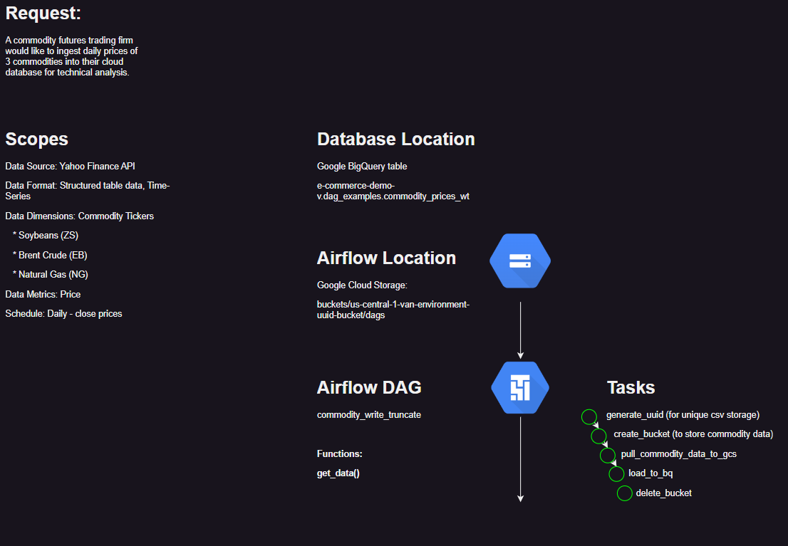

Key Objective:

Deploy an Airflow data API ingestion DAG (directed acyclic graph) to Google Cloud Platform that loads commodity prices to a BigQuery database.

Primary Benefit:

Learn the basics of Airflow orchestration to schedule automated data ingestion tasks.

Secondary Benefit:

Introduction to Airflow operators that will allow you to deploy orchestrated algorithmic tasks in the future.

## Repository Structure

This repository does not act as a Python package. Instead, it acts as a reference for storing your DAG code that will be uploaded to Google's Cloud Composer. Development Operations (DevOps) specializes in deploying code to production and requires more expertise. For now, understand that this example demonstrates a functional approach, but managing a deployable code base would be required to scale ingestion operations efficiently.

```
data_engineer_api_pipeline
│   .gitattributes
│   .gitignore
│   LICENSE
│
└───src
    ├───commodity_prices
    │   │   create_bq_historic_table.py
    │   │   __init__.py
    │   │
    │   └───dags
    │           dag_commodity_write_truncate.drawio
    │           dag_commodity_write_truncate.py
    │           __init__.py
    └───utils
            gcp_utils.py
            __init__.py
```

Because the idea is to create a commodity price ingestion script, within the `/src` folder, I included a subdirectory called `/commodity_prices`. In this article, one DAG will be covered, but there will inevitably be room to add more, so I have created a folder where `/dags` can be stored.

Within the `/dags` folder exists Python files that will be uploaded to Cloud Composer as well as `.drawio` flow chart files to visually illustrate the process of each DAG. Visualizing the scopes, process, and tasks that should occur in a scheduled script is always a good idea.

In the event a csv with historic information and formatting is provided, I have included a `create_bq_historic_table.py` file that can be run to upload the data to BigQuery. That process will not be covered, but is available for reference.

## From Idea to Implementation: Walking Through the Script's Process

You want your process to cover the folling scopes:

* dimensions: dates and commodity tickers
    * date range: 2022-01-01 thru today's date
    * commodity tickers: Soybeans (ZS), Brent Crude Oil (EB), and Natural Gas (NG)
* metrics: prices and volume
    * 'Adj_Close', 'Close', 'High', 'Low', 'Open', 'Volume'

You want to accomplish the following tasks in the following order:

1. Collect historic commodity prices for the commodities in scope
2. 

## Configuring a GCP Project For Cloud Composer (Airflow)

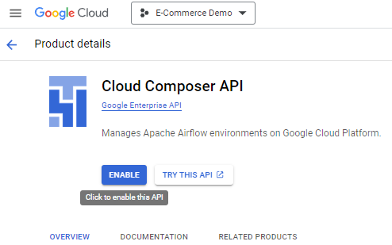

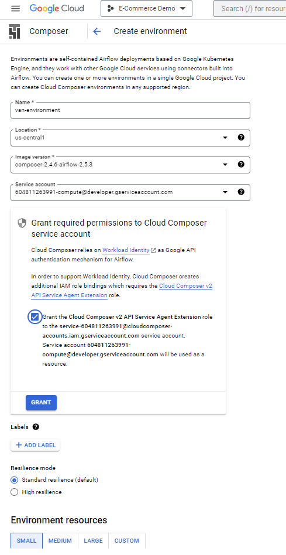

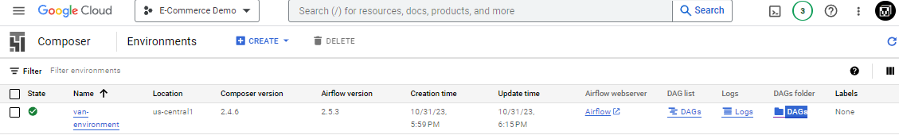

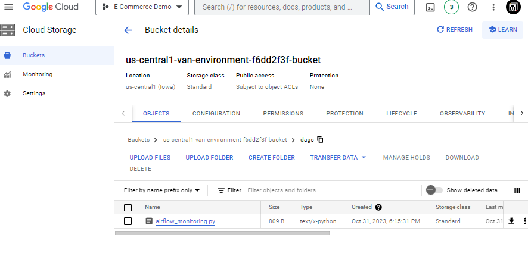

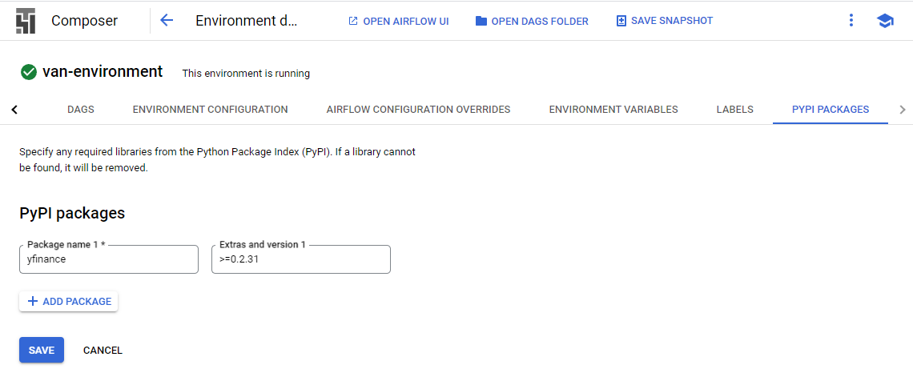

## GCP Services and Directory Overview

* Cloud Composer

* Google Cloud Storage
    * DAGs folder
    * tmp folders


## WRITE TRUNCATE

"analyst wants daily stock information but doesn't have any data for you scenario"

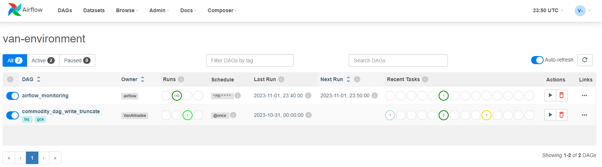

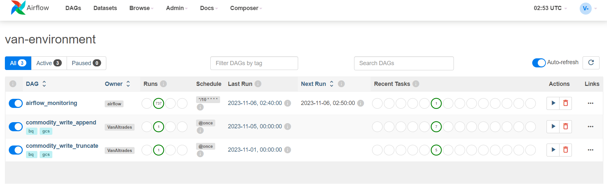

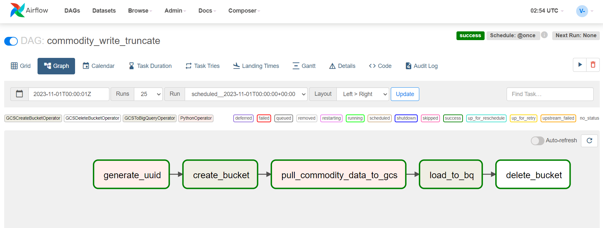

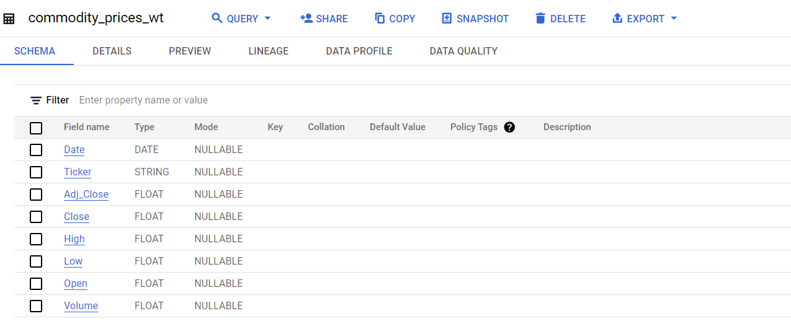

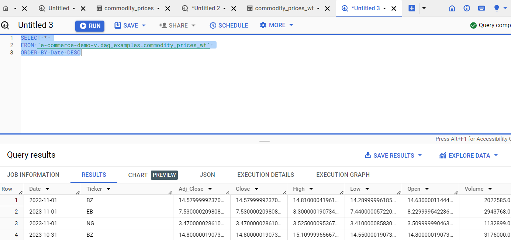

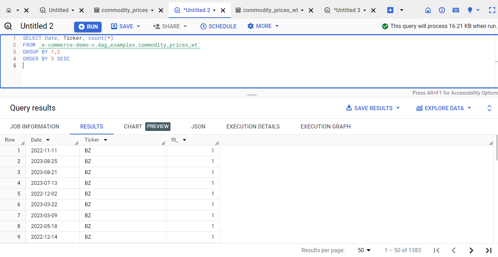

## WRITE APPEND

"analyst handed you a csv of historic data scenario" - backfill data by running `$ python -m data_engineer_api_pipeline.src.commodity_prices.setup_bq`

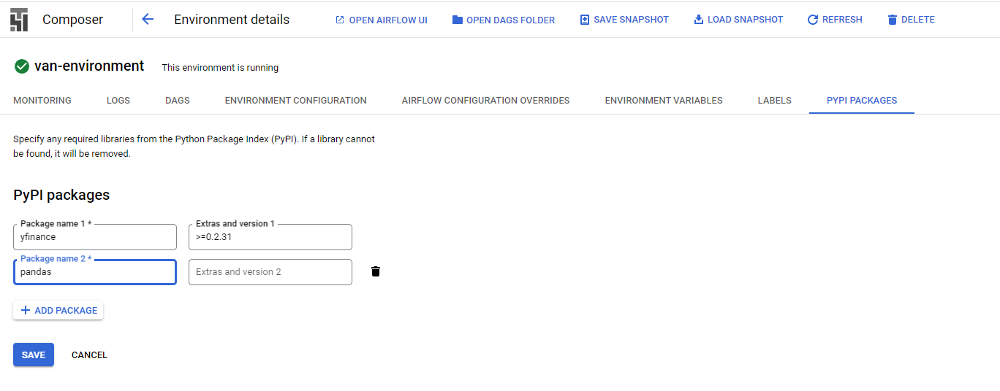

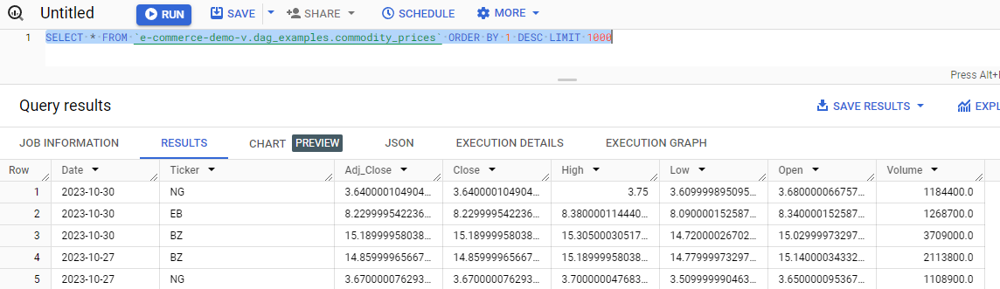

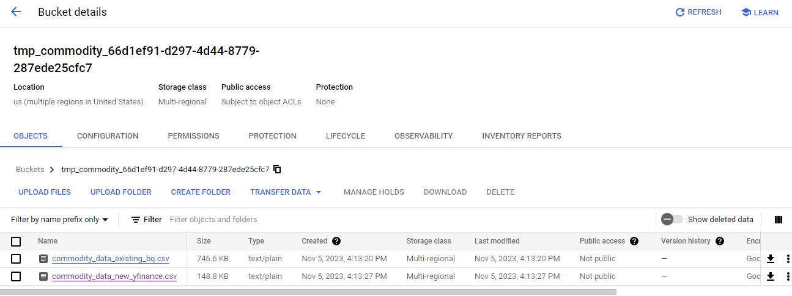

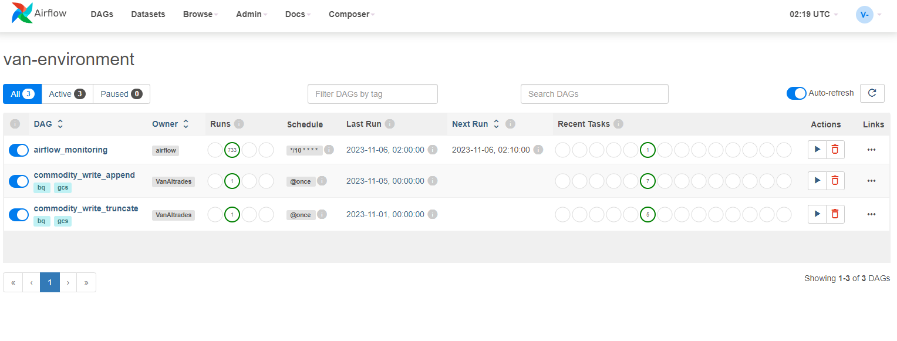

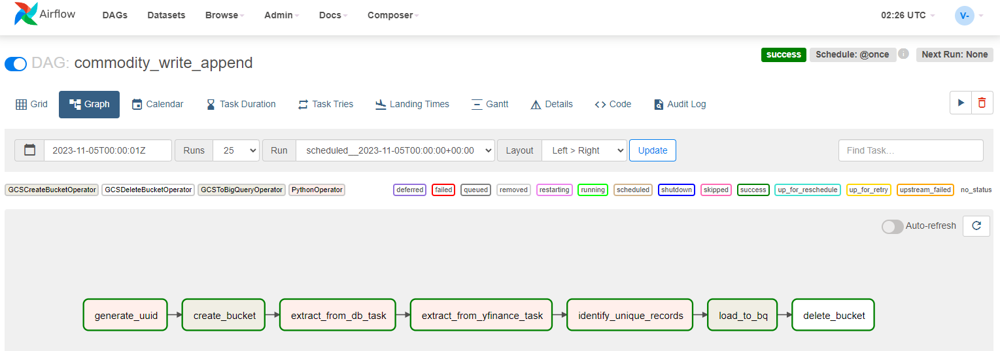

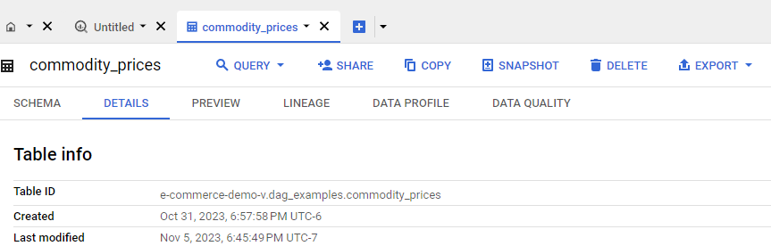

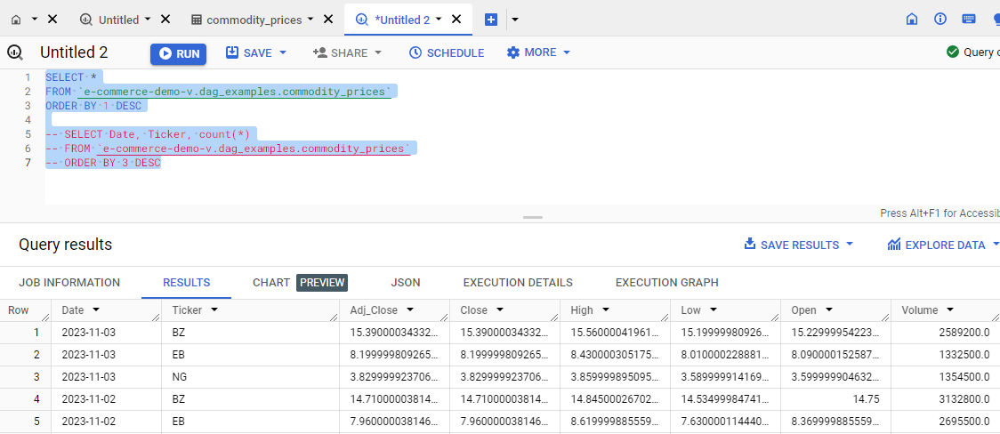

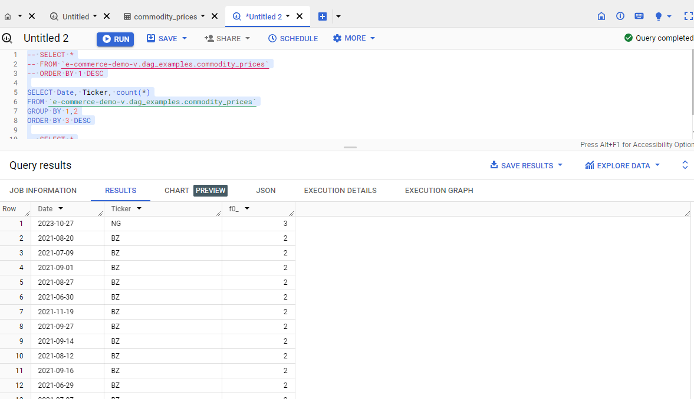

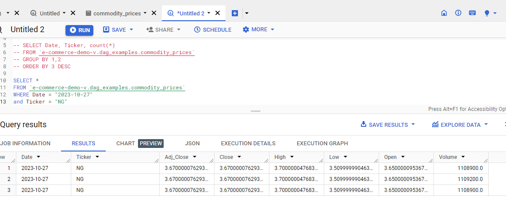

So where to from here...
Read and understand how to optimize your DAG by reading articles and documentation, then edit the dag(long-term).

Places to start...
2. run sql script that removes duplicates from the `commodity_prices` table as another task in the existing dag (more processing?).
3. modify the `identify_unique_records` task if the drop_duplicates python method is not working as expected.
4. confirm the `write_disposition='WRITE_APPEND'` argument of the BigQuery operator is correct.
5. Consider a new design, not deleting your GCS bucket would be a good start. If the bucket is left, you could explore it's csv files to check for duplicates there. 
6. confirm the original csv did not contain duplicates prior to inclusion in BigQuery.
7. If other successful dags run as expected, reference their file to identify solutions from prior work.