# Build a Databricks API Pipeline that Loads Data to BigQuery on GCP

[Medium Article](https://medium.com/@vanaltrades/build-a-databricks-api-pipeline-that-loads-data-to-bigquery-on-gcp-the-analysts-guide-to-data-ae828d3b824c)

## All your data, analytics and AI on one Lakehouse platform

In a previous [article](https://medium.com/@vanaltrades/orchestrating-api-data-into-bigquery-using-airflow-the-analysts-guide-to-data-engineering-0bd6733b5d91?source=your_stories_page-------------------------------------), I explained how to use cloud managed Apache Airflow to extract, transform and load data from yFinance's API response to a BigQuery table.

While Apache Airflow is a marvel of open source development and a useful tool in a data engineer's toolkit, other tools exist to help analysts and data engineers build, manage and maintain data pipelines.

Enter Databricks, a unified analytics platform based on Apache Spark. In this article, analysts and engineer will learn how to build the exact same Airflow data pipeline ([repo](https://github.com/VanAltrades/data_engineer_api_pipeline/tree/main/src/commodity_prices/dags)) using Databricks.

In the process, readers will learn that Databricks provides a familiar Notebook based environment, a lower barrier to entry via Apache Spark, and a platform built to manage not just pipelines - but also reporting and machine learning.

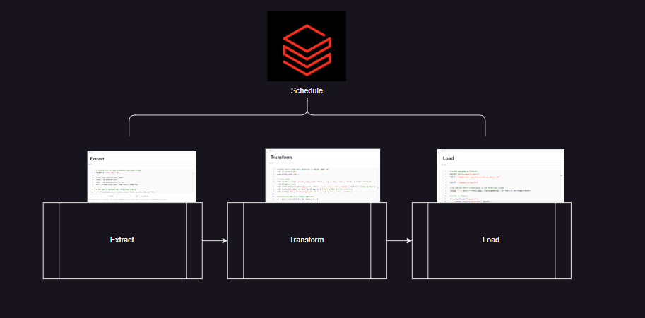

**Key Objective:**

Deploy and schedule an API pipeline on a Databricks notebook that loads to a Google Cloud BigQuery table.

**Primary Benefit:**

Learn the basics of the Databricks environment to schedule automated data ingestion tasks.

**Secondary Benefits:**

Understand how Databricks can save you and your organization time in engineering tasks.

Experience the simplicity of Databricks orchestration.

Setup Databricks on the Google Cloud Platform.

Explore the Databricks environment that can be used to manage reporting and ML ops.

## Configure Databricks in Your GCP Environment 

**Google Cloud Platform (GCP) Service Account:**

Create a Service Account: In the Google Cloud Console, navigate to the IAM & Admin section. Create a service account if you haven't already.

Assign Roles: Assign the necessary roles to the service account, such as BigQuery Data Editor or BigQuery Admin, depending on the level of access needed.

Create a JSON Key File: Generate a JSON key for the service account. This file contains the credentials needed to access BigQuery from your Databricks environment.

**Subscribe to Databricks through GCP Marketplace**

In this example, I am using the free tier 14 day trial offering:

* Managed Apache Spark: Yes
* Optimized Delta Lake: Yes
* Cluster Autopilot: Yes
* Jobs Scheduling & Workflow: Yes
* Notebooks & Collaboration: Yes
* Databricks Runtime for ML: Yes
* Optimized Runtime Engine: Yes
* Administration Console: Yes
* Single Sign-On (SSO): Yes
* Role-based Access Control: Yes
* Token Management API: Yes

Navigate to the GCP marketplace page and search for Databricks. Sign up.

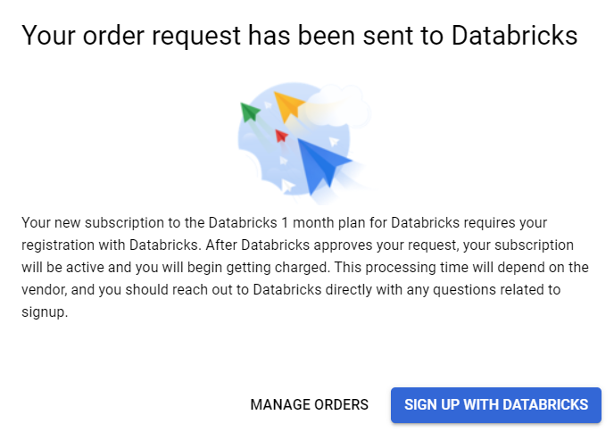

Sign up via the Databricks link and you will receive a GCP email with the following title: "Your Databricks trial has now started"

This email will link you towards documentation for [Databricks on GCP](https://docs.gcp.databricks.com/).

Click the Manage on Provider link where you specify your subscription plan.

**Configure the Databricks Workspace/Environment**

Create a workspace in the Databricks UI

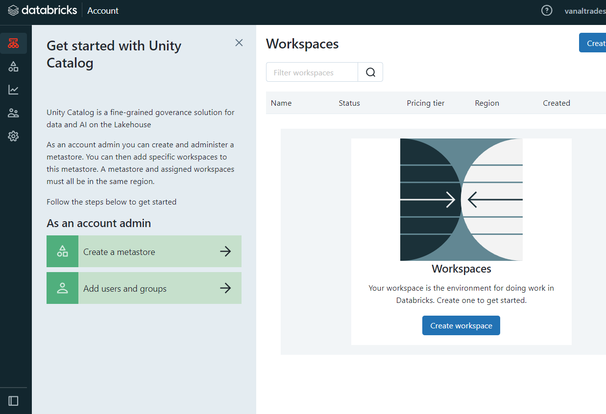

Note: As part of creating this workspace, two Google Cloud Storage buckets will be created in your GCP project. These buckets will host the data that is put in the external DBFS storage and internal DBFS storage, respectively. Please review the access controls on these buckets in the GCP console. Read more

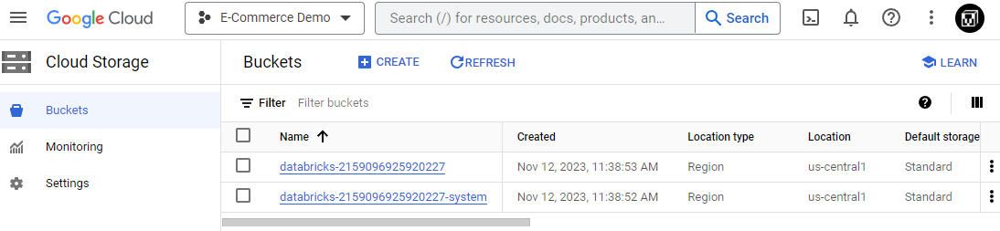

Refresh and note that the workspace will take a moment to be provisioned.

[GCP Databricks Setup reference](https://cloud.google.com/bigquery/docs/connect-databricks)

Though not used in this example, a temporary storage cloud storage bucket may be worthwhile to setup for future/more complex tasks - in this case `databricks-bq-2023`. 

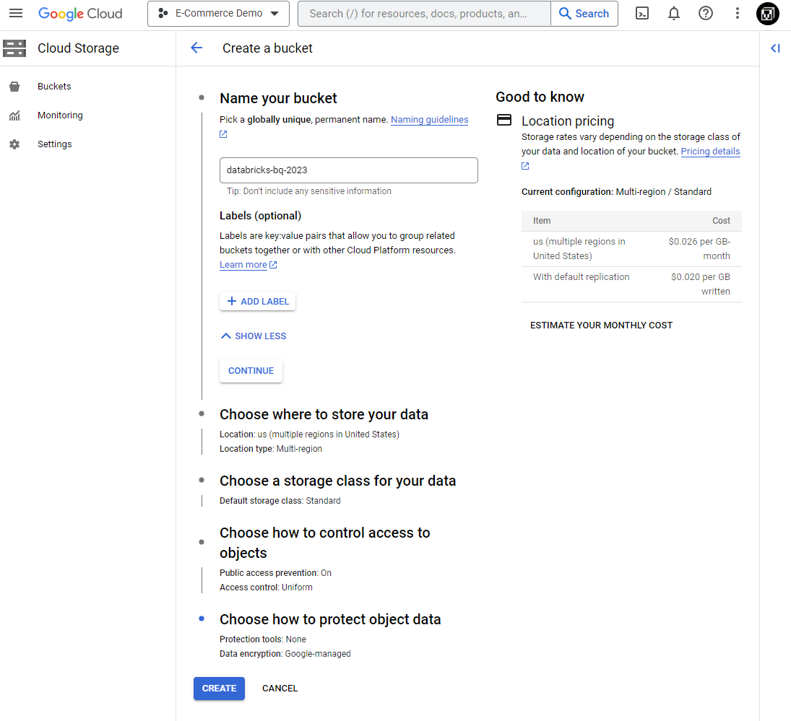

Next, we need to grant an existing GCP service account access to Databricks so we can read and write to the BigQuery service.

Add Service Account to GCS under Permissions page

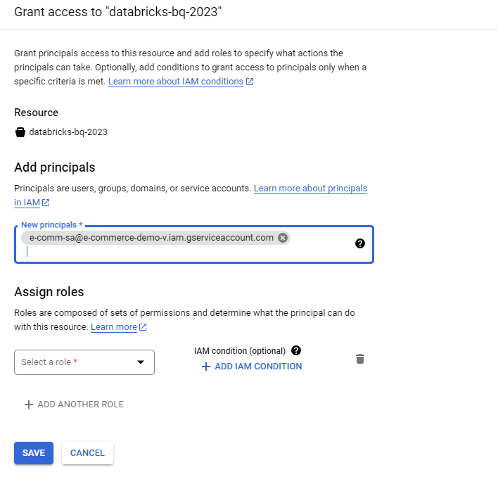

With the Databricks workspace created, it's time to spin up a compute cluster via the Databricks UI.

In the context of Databricks, a cluster refers to a set of computing resources used to process data and run computations. Databricks clusters are a fundamental component of the Databricks Unified Analytics Platform, built on Apache Spark.

Key characteristics of a Databricks cluster include:

1. Scalability: 

Clusters can be easily scaled up or down based on the workload requirements. This scalability allows for efficient resource allocation and management.

2. Apache Spark: 

Databricks clusters run Apache Spark, a powerful distributed data processing engine. This allows them to perform various tasks such as data transformations, analysis, machine learning, and more.

3. Isolation: 
Each cluster is isolated, providing a dedicated environment for computations. This isolation ensures that the resources allocated to one cluster do not affect others.

4. Configuration Options: 

Databricks provides different cluster configurations suited for various use cases, offering control over the choice of machine types, the number of worker nodes, and the Spark configurations.

5. Collaboration: 

Multiple users can collaborate on a Databricks cluster, sharing notebooks and resources, making it an ideal environment for team collaboration on data-related tasks.

6. Unified Platform: 

Databricks clusters are part of a unified platform that integrates data engineering, data science, and business analytics, providing an end-to-end solution for data-driven activities.

Be sure to outfit the Databricks cluster with your service account.

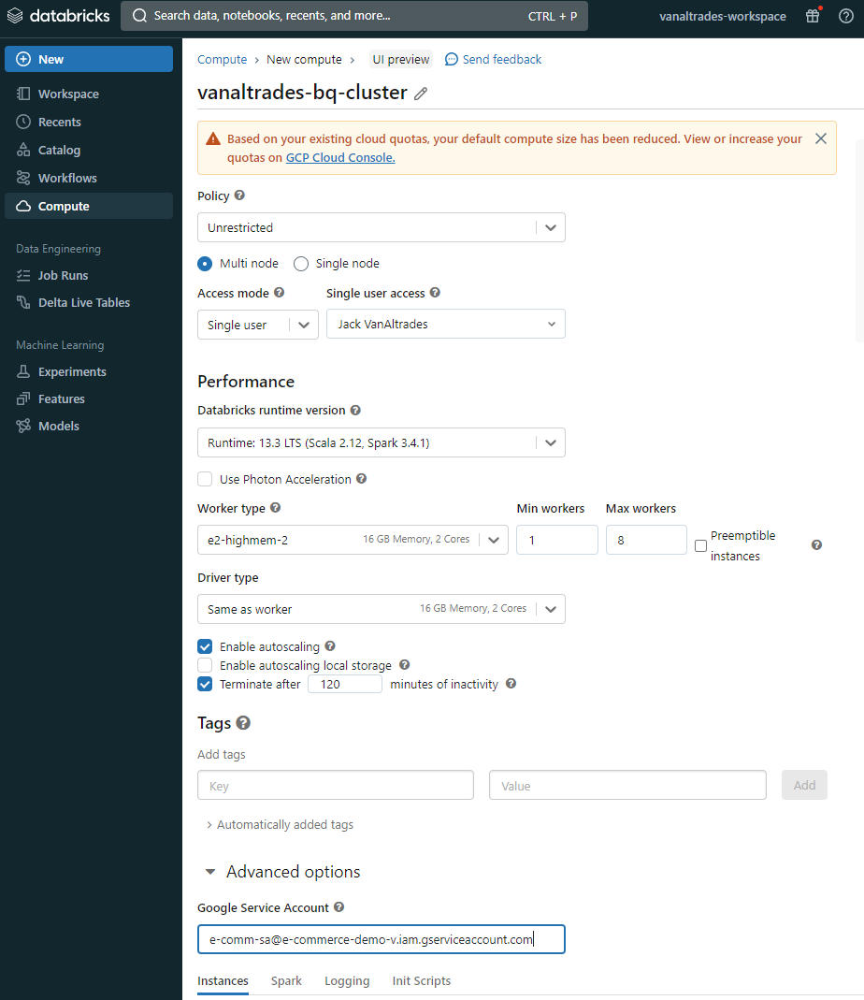

We will use the yFinance API to extract commodity price data. This package is not pre-installed in our cluster, so we will need to navigate to the "Install library" page under the cluster UI.

Add the yfinance python package to cluster library.

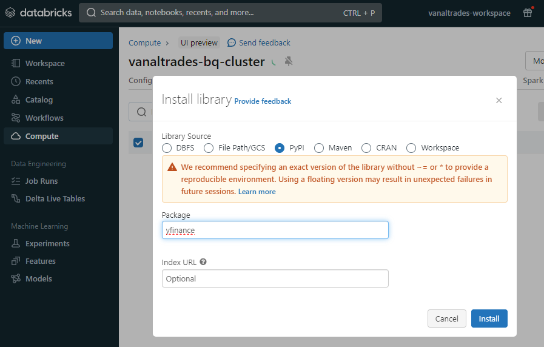

Databricks has a quick learning curve because it hosts cloud Notebooks to perform data operations.

Add new notebook under the Workspace tab.

## Test Your Databricks Access

I want to confirm that my Service Account with access to GCS and BigQuery is working as expected in the Databricks notebook. I test my GCP connection on an existing BigQuery table, by reading it into the notebook.

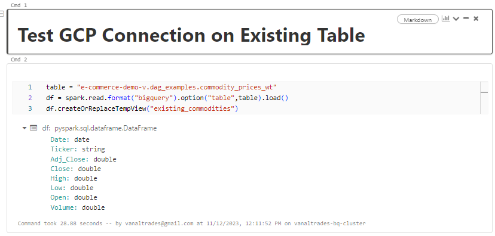

## Create an ETL Pipeline using a Databricks Notebook

It's all a breeze from here if you are familiar with Python, Apache Spark, or Jupyter Notebooks.

I import required packages and initialize a Spark session.

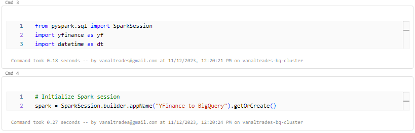

Next, I use existing code from the previous article to extract data from yFinance.

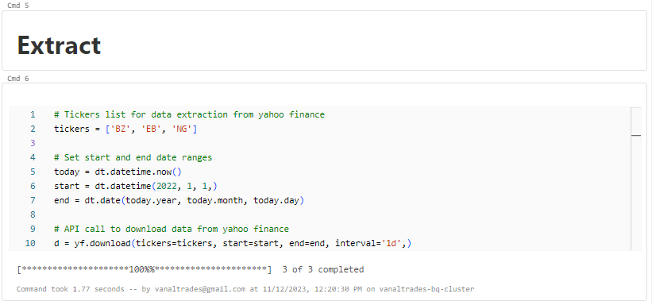

Then I transform the data to a format I want.

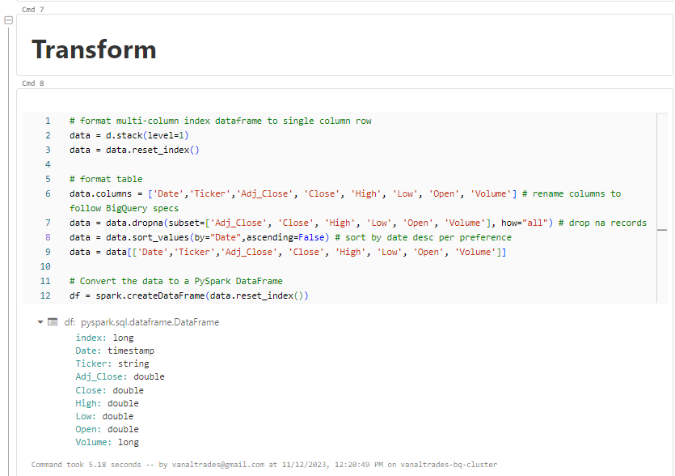

And I load the data to BigQuery.

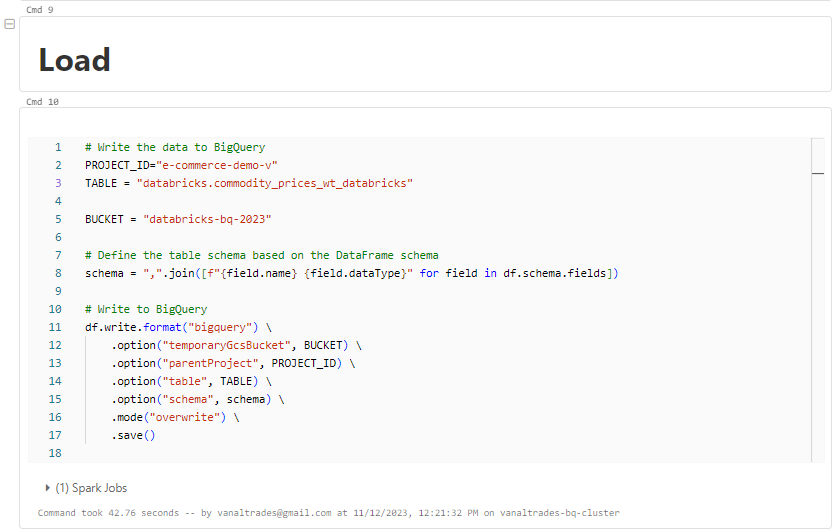

And just like that, the data is loaded into a new BigQuery table.

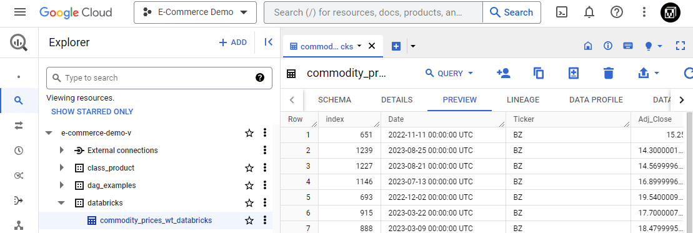

Finally, I can use the Databricks' schedule option to schedule this notebook.

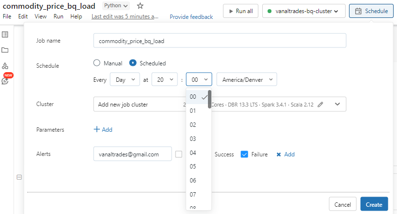

## Where to Next?

Databricks is a phenominal addition to the cloud services space.

It has a lower barrier to entry, in my opinion, than other tools and provides a workspace where analysts, engineers, devops, and managers can intuatively colaborate.

Explore the Databricks environment you've created and read up on the vast capabilities that can be unlocked with Databricks.

Consider learning how to configure your environment with Git for seamless collaboration.

Read up on how ML taks can be scheduled on clusters.

The sky is the limit, and I hope this was a quality introduction into the Databricks ecosystem hosted on Google Cloud Platform.

-- Jack VanAltrades