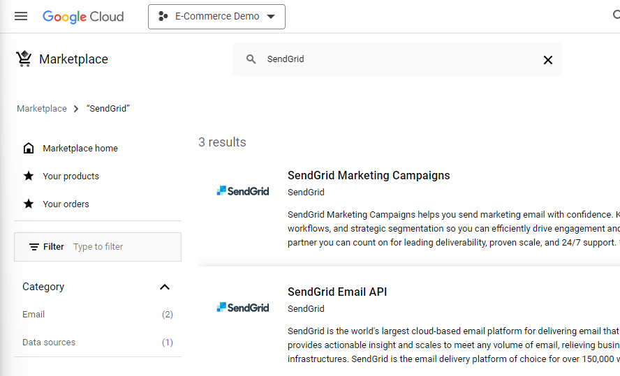
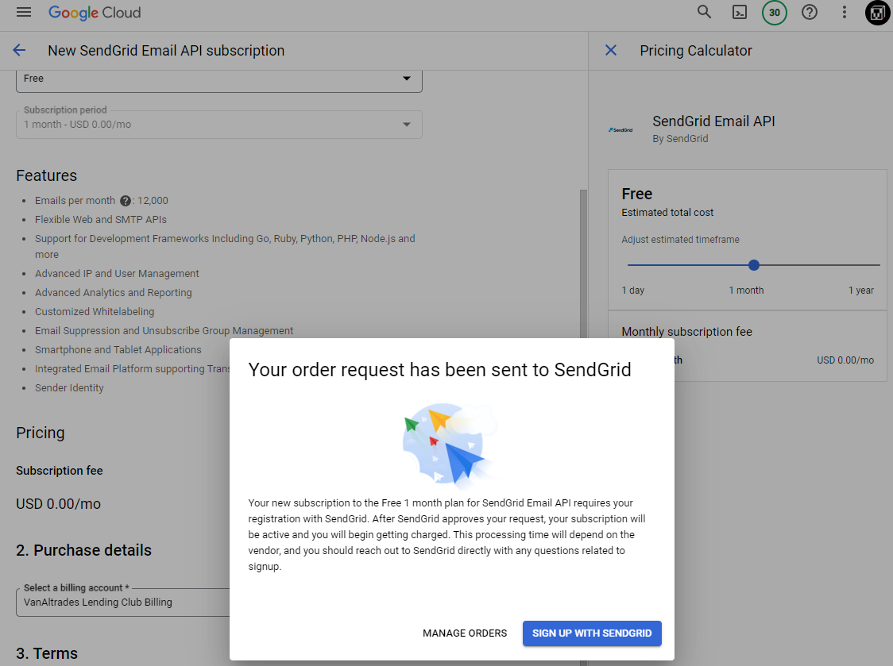

Steps to Send Email Notifications in Databricks:
1. Set Up an Email Service:
You can use an email service provider like SendGrid or AWS SES to send emails. Set up an account with one of these services and get the necessary API keys or credentials.





```
Your new Twilio SendGrid account has been created.

Please refresh the GCP page and click 'MANAGE ON PROVIDER'
```

2. Python Script in Databricks:
Write a Python script within a Databricks notebook to send an email based on a specific condition. Here's a sample code using SendGrid:

