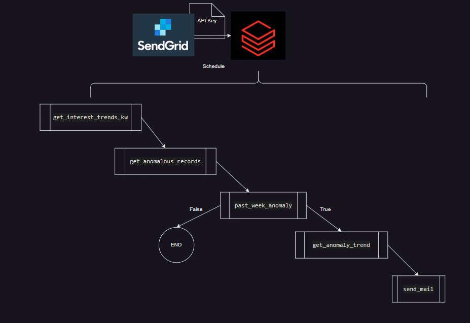

# Detect Market Demand Anomalies and Schedule Alert Emails with Databricks

[Medium Article](https://medium.com/@vanaltrades/detect-market-demand-anomalies-and-schedule-alert-emails-with-databricks-the-analysts-guide-to-b75f08bc1876)

## Extending Databricks notebooks for anomaly detection.

My [previous article](https://medium.com/@vanaltrades/build-a-databricks-api-pipeline-that-loads-data-to-bigquery-on-gcp-the-analysts-guide-to-data-ae828d3b824c) explains how to configure Databricks within GCP and schedule an API pipeline which loads to BigQuery.

In this article, I will use Databricks notebooks for reporting.

Imagine you are an upstart fashion brand. You have 3 unique product offerings (corduroy hats, corduroy pants, and trail running packs). You want to omptimize spend and marketing campaigns by understanding market demand for your products.

Using the Google Trends API, you are able to collect weekly search volume trends on Google for your products.

To save time, you plan on emailing yourself each Sunday to alert you to a spike in demand for your products if the search volume is greater than the 75th percentile of historic demand.

https://github.com/VanAltrades/data_engineer_api_pipeline/tree/main/src/market_demand


**Key Objective:**

Build and manage a weekly anomaly detection Notebook in Databricks that sends emails when demand spikes.

**Primary Benefit:**

Understand reporting automation with Databricks on GCP.

**Secondary Benefits:**

Integrate SendGrid's email API within GCP.

Store secret keys in production.




## Configuring the SendGrid API in GCP:

To send emails programmatically, this example will use SendGrid.

With GCP's marketplace, search for SendGrid.


The free tier allows you to send <= 12K emails per months. This will be plenty for now.


Note the following:

```
Your new Twilio SendGrid account has been created.

Please refresh the GCP page and click 'MANAGE ON PROVIDER'
```

Next, you will need to navigate to SendGrid and authenticate yourself. Please note there are alternative approaches to send programatic emails... this is just one method.

**Create Identity**


And verify sender via email link.

**Create API Key**


Copy the API key that has been created and navigate to your Databricks cluster settings.

Under the Spark tab, you can name your API key and set it's value (although this is NOT recommended). 

You should never hard code secrets or store them in plain text. Use the Secrets API 2.0 to manage secrets in the Databricks CLI. Use the Secrets utility (dbutils.secrets) to reference secrets in notebooks and jobs.


Alternatively, you can set your secret key using the Secrets API, the Databricks CLI, or the following code on a local machine:

```
echo "export SENDGRID_API_KEY='xxxx'" > sendgrid.env
echo "sendgrid.env" >> .gitignore
source ./sendgrid.env
```

**Install Required Libraries**

This program will require trend vizualization via `plotly`, `pandas` for transformations, `pytrends` to request market demand, and `sendgrid` to send alert email.

Based on the following import statement, be sure to install these packages to your Databricks cluster.

```
import plotly.express as px
import plotly.graph_objects as go
import matplotlib.pyplot as plt
import pandas as pd
from pytrends.request import TrendReq
import sendgrid
from sendgrid.helpers.mail import *
```


**Write your Python Script in Databricks:**

Finally, create a new Notebook on your Databricks' cluster where you will define how your alert will run.

Below is a breakdown of the logic.

Define the keywords you want to monitor each week:

```
keywords_to_monitor = ["corduroy hat","corduroy pants","trail running pack"]
```

Define the function that will collect weekly search demand via the pytrends package:

```
def get_interest_trends_kw(keyword, pytrends = TrendReq(hl='en-US')):
    kw=keyword
    pytrends.build_payload(kw, cat=0, timeframe='today 5-y', geo='US')
    df = pytrends.interest_over_time()
    df.reset_index(inplace=True)
    return df
```


You don't want to be alerted on weeks where your products have low demand. Explore your data's percentiles to find thresholds that should trigger alerts. In this case, a search volume >= a keyword's 75th percentile of historic values should work.


I decided to create a function that takes a keyword value and returns a dataframe with that keyword's search volume, and a new boolean column defining whether or not an anomaly has occured on a given week:

```
def get_anomalous_records(data, date_key : str, metric, quantile_threshold : float = 0.75):

    data[date_key] = pd.to_datetime(data[date_key])

    # Filter and sort the DataFrame
    data = data[[date_key, metric]].sort_values(by=date_key, ascending=False)

    # Set timestamp as index
    data.set_index(date_key, inplace=True)

    # Set 75th Percentile threshold
    threshold = data[metric].quantile(quantile_threshold)

    # Define a function to set the 'anomaly' column
    def set_anomaly(row):
        return (row[metric] > threshold)

    # Add an 'anomaly' column based on the defined function
    data['anomaly'] = data.apply(set_anomaly, axis=1)

    # Replace NaN metrics with 0
    data_anomaly = data.fillna(0)

    return data_anomaly
```


And I will define a logic check that will return `True` if the most recent week's search demand is anomalously high.

```
def past_week_anomaly(df_anom):
    if df_anom[df_anom.index == df_anom.index.max()]["anomaly"][0] == True:
        return True
```

Next, the email should visualize the search demand trend and add markers where anomalies exist. Because I want to email a visualization, I also save the plot to a `png` file to add as an attachment.

```
def get_anomaly_trend(df,metric):

    fig = px.line(
            df,
            x=df.index,
            y=metric,
            title=f"{metric.title()} Anomalies",
            template = 'plotly_dark')
    # create list of outlier_dates
    outlier_dates = df[df['anomaly'] == True].index
    # obtain y metric of anomalies to plot
    y_metrics = [df.loc[i][metric] for i in outlier_dates]
    fig.add_trace(
        go.Scatter(
            x=outlier_dates, 
            y=y_metrics, 
            mode = 'markers',
            name = 'anomaly',
            marker=dict(color='red',size=10)
            )
        )
    # fig_html = fig.to_html(full_html=False)
    fig.write_image(f"anomaly_{metric.replace(' ','_')}.png")
    return fig
```


The last function defines an email that will be send with anomaly details.

Be sure to include your SendGrid API key in your environment to run successfully.

```
def send_mail(_from : str, _to : str, kwd : str, api_key : str):
    # Prepare the email content
    message = Mail(
        from_email=_from,
        to_emails=_to,
        subject='Weekly Keyword Search Volume Increase - Demand > 75th Percentile',
        html_content='<strong>Check out the trend visualization:</strong>')

    # Read the image file
    with open(f"./anomaly_{kwd.replace(' ','_')}.png", 'rb') as f:
        data = f.read()
        f.close()

    # Attach the image to the email
    encoded_file = os.path.basename(f"./anomaly_{kwd.replace(' ','_')}.png")
    attachedFile = Attachment(
        FileContent(encoded_file),
        FileName(encoded_file),
        FileType('image/png'),
        Disposition('attachment')
    )
    message.attachment = attachedFile

    # Send the email via SendGrid
    try:
        sg = SendGridAPIClient(api_key)
        response = sg.send(message)
        print(response.status_code)
        print(response.body)
        print(response.headers)
    except Exception as e:
        print(str(e))
```

Finally, I make a loop that runs through each keyword and flows through our defined functions:

```
for kwd in keywords_to_monitor:
    df_anom = get_anomalous_records(trends, "date", kwd)
    if past_week_anomaly(df_anom) == True:
        get_anomaly_trend(df_anom,kwd)
        send_mail(_from="yy@gmail.com", _to="xx@gmail.com", kwd=kwd, api_key=os.getenv("SG_API_KEY"))
```

Schedule the script to run weekly on Sunday. Be sure to check when API data loads and is complete for the most accurate data.


And within SendGrid, I note the emails have sent!


## Where to Next?

You've taken one step towards optimizing your workday.

Explore other mediums besides email to alert you towards anomalies. 

Perhaps you can change the email address to a Slack channel to be alerted in a group Slack chat?

Perhaps you want to explore how to send these alerts and visualizations to BI tools?

You could also create a Cloud Storage bucket with a large list of keywords to run through this script.

By understanding Databricks and Python, the sky is the limit for what you can create.

--Jack VanAltrades