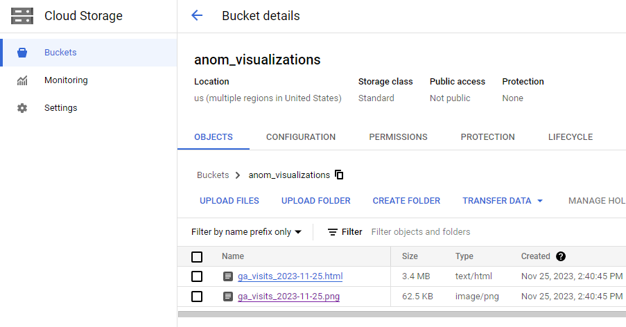

# Traffic Anomaly Email Alert DAG

[medium article](https://medium.com/@vanaltrades/detect-daily-anomalies-and-send-plotly-email-alerts-with-airflow-the-analysts-guide-to-data-b8b87088bf21)

Analysts are the domain experts of their organization's information. With an expertise in areas of their business to monitor and report upon, analysts should combine concise reporting with timely notices.

For example, an e-commerce analyst may be tasked with monitoring traffic levels to their website. In an ideal world traffic follows an expected distribution of traffic that grows linearly or exponentially overtime. But the unexpected nature of the market can see some days see traffic declines or increases that an analyst should be aware of and be able to explain in a timely manner. In addition, perhaps an unexpected change in traffic attribution or a site change completely breaks analytics and repoting. In this case, an analyst should be able to identify an anomalous change from an expected value and pursue a root cause identification and solution.

With many areas of an organization to monitor, spending a brief amount of time to configure an daily script to detect unexpected swings in key performance indicators becomes an invaluable tool in an analyst's toolkit.

Enter Airflow for anomaly detection. With a short setup, analysts can leverage batch processing to save large amounts of time and accurately assess a swing in KPIs in perpetuity.

https://github.com/VanAltrades/data_engineer_api_pipeline/tree/main/src/traffic_anomaly

This article will explain how analysts can plan and implement a cloud orchestrated anomaly alerting system that emails stakeholders when swings in expected values occur.

**Key Objective:**

Outfit your organization with daily anomaly detection alerts based on internal database data.

**Primary Benefits:**

Plan a pipeline's logic and translate the logic to a Python script.

Build and understand implementing multiple anomaly algorithms into an Aiflow script.

Learn Aiflow features including XCOMs, PythonOperators, ShortCircuitOperators, PythonBranchOperators and looping through variable task dependencies.


**Secondary Benefits:**

Alerts based on a single metric.

Alerts based on multiple metrics from a single source.

Using Airflow to interact with BigQuery and Google Cloud Storage.

Using Airflow to send emails with visualization attachments.

## Configure Airflow Environment in Apache Airflow

In a previous article, I covered how to setup an Airflow environment using Google Cloud Platform's Cloud Composer offering. Follow along or research yourself. 

https://medium.com/@vanaltrades/orchestrating-api-data-into-bigquery-using-airflow-the-analysts-guide-to-data-engineering-0bd6733b5d91

Airflow environments in Google come with installed Python packages like pandas and the python core library. One requirement of this alert is the ability to include data visualizations. Be sure to navigate towards your Cloud Composer's PyPi installation page to install the plotly and kaleido packages to allow for rich visualizations. 

This example will send emails from a gmail account. There are other options to send emails like SendGrid, so feel free to augment this instruction with what works with you. To enable the ability to send emails from a gmail account, I followed [these instructions](https://www.letscodemore.com/blog/smtplib-smtpauthenticationerror-username-and-password-not-accepted/). You will be required to turn on Gmail's 2 factor authentication, [create](https://myaccount.google.com/apppasswords) a new app password, and store the password in your environment variables.

Be sure to save your email app password. This password will be set as the email sender's password within the cloud composer's environment variables.


Finally, a Google Cloud Storage bucket will be used as a data store in the script so make a GCS bucket and use it's name as a variable in the coming script.


## Logic Overview

Below is an outline of what needs to occur for this pipeline to work. Be sure to brainstorm material steps required in your intended process. The outline below is abstract. For instance, "retrieve data from database" could be modified to your scenario (ex. AWS, GCP, Azure, etc.).

* declare intended output (in this case, check if most recent day is anomaly)

* declare variables and threshold for anomaly (metrics, storage locations, cutoffs for anomalies, etc.)

* retrieve data from database

* format time-series data

* label anomalous record identifiers in a new column

* determine if most recent day record is anomalous

* if most recent record is not anomalous then stop all processing

* if most recent record is anomalous then continue processing

* if most recent record is anomalous create a trend visualization that highlights anomalies

* if most recent record is anomalous store the visualization to a GCS bucket for email attachment

* if most recent record is anomalous send the visualization to email recipients

From this outline, I've visualized the flow. This can be helpful to reference in the future or share with your organization.


## Logic Approach #1: Quantile Boundary

In the approach above, the "determine if most recent day record is anomalous" step requires some simple algorithm to classify a day's value as anomalous. There are many approaches you may choose to explore, but it can always be beneficial to start small and build up.

As a simple introduction implementing an algorithm into a pipeline, I will give a brief overview of the first algorithmic threshold exemplified in this article - quantile bounds.

Quantiles are values that divide a dataset (the metric column in this case) into intervals of equal probability. The concept is commonly used in statistics and probability theory to describe the distribution of a set of data. For instance, the median is a quantile that divides a dataset into two equal halves, while quartiles divide it into four equal parts.

Anomaly detection involves identifying patterns in data that deviate significantly from the norm or expected behavior.

Because quantiles relay distributions of normal data, using quantile bounds to label anomalies should be a simple way to proof out an anomaly alert.

## Creating a Single Metric Anomaly DAG

Now into translating the idea into code.

First up, variables will be defined. Be sure to import both script-level and environment level variables defined earlier:

```
# env variables
ANOM_EMAIL_FROM = os.environ.get("ANOM_EMAIL_FROM")
ANOM_EMAIL_FROM_PW = os.environ.get("ANOM_EMAIL_FROM_PW")
ANOM_EMAIL_TO = os.environ.get("ANOM_EMAIL_TO")

# script's variables
BUCKET_ANOMALY = 'anom_visualizations'

DATE_NAME = "date"
METRIC_NAME = "visits"
THRESHOLD_LOW = 0.25
THRESHOLD_HIGH = 0.75

CHART_TITLE = f"Google Analytics {METRIC_NAME.title()} Anomalies <br> Days Where {METRIC_NAME.title()} are Outside Day of Week's Quantile Threshold"
ANOMALY_IMAGE_NAME=f"ga_visits_{str(datetime.today().strftime('%Y-%m-%d'))}"
EMAIL_SUBJECT = "GA Visits Outside Day's Expected 0.25-0.75 Quantile Range"
IMG_PATH = f"storage.googleapis.com/{BUCKET_ANOMALY}/{ANOMALY_IMAGE_NAME}.png"

DAG_NAME = 'anomaly_ga_visits'
DAG_DESCRIPTION = 'Alert an email address if GA Visits fall outside 0.25-0.75 quantile.'

SQL = """
      SELECT 
        ...
    """
```

Then retrieve data from a database. In this example I am pulling data from BigQuery and passing it into a task instance variable using `xcom`. 

This approach let's me perform operations in each task defined earlier and hand it off to another task (which is helpful for debugging).

```
  def get_data_from_bq(**kwargs):
      # Define the BigQuery connection ID
      bigquery_conn_id = 'bigquery_default'
      # Create a BigQuery hook
      bigquery_hook = BigQueryHook(bigquery_conn_id)
      # Execute the query and get the result as a Pandas DataFrame
      result = bigquery_hook.get_pandas_df(sql=SQL, dialect='standard')
    #   print(result)

      # Push the data to XCom
      kwargs['ti'].xcom_push(key='bq_data_key', value=result.to_dict(orient='index'))
```

I can call this function from a task using the PythonOperator. This logic is used for all PythonOperator tasks in the dag.

```
  t1 = PythonOperator(
      task_id='t1_get_data_from_bq',
      python_callable=get_data_from_bq,
      provide_context=True,
      dag=dag
  )
```

Next, I format the data. Because I want day level anomaly detection, a column that classifies a date as a day of week is needed to only compare a recent day to it's historic day of week quantiles.

If errors occur when running the DAG, be sure to print output to review and understand how data is transfered.

In my case, I found that passing off a dataframe to xcoms did not work because the data was not JSON serializable. I was able to push the previous step's data to a task instance using `xcom` as a dict, and pulling the data as a dict then transforming it into a DataFrame for operations in the format step.
```
  def format_data(**kwargs):

    ti = kwargs['ti']
    bq_data = ti.xcom_pull(task_ids='t1_get_data_from_bq', key='bq_data_key')
    bq_data = pd.DataFrame.from_dict(bq_data, orient='index')

    data = bq_data[[DATE_NAME,METRIC_NAME]].copy()
    data[DATE_NAME] = pd.to_datetime(data[DATE_NAME], errors='coerce')
    # add name of day column
    data.loc[:,'day_name'] = data[DATE_NAME].dt.day_name()
    data[METRIC_NAME] = data[METRIC_NAME].astype('int64')
    
    # Convert datetime values to strings for xcom
    data[DATE_NAME] = data[DATE_NAME].dt.strftime('%Y-%m-%d')

    # set timestamp to index
    data.set_index(DATE_NAME, drop=True, inplace=True)
    kwargs['ti'].xcom_push(key='data_formated_key', value=data.to_dict(orient='index'))
```

To classify daily anomalies based on criteria, the `classify_anomaly()` function sets day of week bounds in new columns and then applies new boolean values if the day's values are greater than or less than the bounded range.

```
  def classify_anomaly(**kwargs):
    
    ti = kwargs['ti']
    data = ti.xcom_pull(task_ids='t2_format_data', key='data_formated_key')
    data = pd.DataFrame.from_dict(data,orient='index')

    # Set 25th Percentile threshold
    data['quantile_0.25'] = data.groupby('day_name')[METRIC_NAME].transform(lambda x: x.quantile(THRESHOLD_LOW))
    data['quantile_0.75'] = data.groupby('day_name')[METRIC_NAME].transform(lambda x: x.quantile(THRESHOLD_HIGH))
    
    # Define a function to set the 'anomaly' columns
    def set_anomaly_low(row):
        return (row[METRIC_NAME] < row['quantile_0.25'])
    data['anomaly_low'] = data.apply(set_anomaly_low, axis=1)
    
    def set_anomaly_high(row):
        return (row[METRIC_NAME] > row['quantile_0.75'])
    data['anomaly_high'] = data.apply(set_anomaly_high, axis=1)
    
    # Replace NaN metrics with 0
    data_anomaly = data.fillna(0)
    
    print(data_anomaly.head()) # LOG
    kwargs['ti'].xcom_push(key='data_anomaly_key', value=data_anomaly.to_dict(orient='index'))
```

The data now has all criteria needed to evaluate if an anomaly occured on the most recent date. The next step will require a logic check in the DAG that will either end the DAG if no anomaly at the most recent date record or continue if an anomaly occured.

To accomplish this step, I used a python function `day_is_anomaly()` that outputs a boolean `True` or `False` depending on the data. This boolean output can be applied to a `ShortCircuitOperator` which acts as a logic gate in the Airflow DAG.

If `True` then continue. It looks like this:

```
  def day_is_anomaly(**kwargs):

    ti = kwargs['ti']
    data = ti.xcom_pull(task_ids='t3_classify_anomaly', key='data_anomaly_key')
    data = pd.DataFrame.from_dict(data,orient='index')
    print(data)

    if data[data.index == data.index.max()]["anomaly_low"][0] == True or data[data.index == data.index.max()]["anomaly_high"][0] == True:
      return True
    
  # ShortCircuitOperator to conditionally skip downstream tasks
  short_circuit_task = ShortCircuitOperator(
      task_id='short_circuit',
      python_callable=day_is_anomaly,
      provide_context=True,
      dag=dag,
  )
```

Excellent! Now onto processing the data as a visualization if the anomaly exists.

I use `Plotly` and want `> bound` values to be green dots, while `< bound` values are labeled as red dots.

I will also leverage the Google Cloud Storage client to save a png and an html file to the bucket. Augment this code with your cloud provider's code if using another platform for storage.

```
  def gcs_create_store_visualization(**kwargs):

    ti = kwargs['ti']
    data_anomaly = ti.xcom_pull(task_ids='t3_classify_anomaly', key='data_anomaly_key')
    data_anomaly = pd.DataFrame.from_dict(data_anomaly,orient='index')

    fig = px.line(
            data_anomaly,
            x=data_anomaly.index,
            y=METRIC_NAME,
            title=CHART_TITLE,
            template = 'plotly_dark')
    
    # create list of outlier_dates below threshold
    outlier_dates_low = data_anomaly[data_anomaly['anomaly_low'] == True].index
    # obtain y metric of anomalies to plot
    y_metrics = [data_anomaly.loc[i][METRIC_NAME] for i in outlier_dates_low]
    fig.add_trace(
        go.Scatter(
            x=outlier_dates_low, 
            y=y_metrics, 
            mode = 'markers',
            name = 'anomaly',
            marker=dict(color='red',size=10)
            )
        )
    
    # create list of outlier_dates above threshold
    outlier_dates_high = data_anomaly[data_anomaly['anomaly_high'] == True].index
    # obtain y metric of anomalies to plot
    y_metrics = [data_anomaly.loc[i][METRIC_NAME] for i in outlier_dates_high]
    fig.add_trace(
        go.Scatter(
            x=outlier_dates_high, 
            y=y_metrics, 
            mode = 'markers',
            name = 'anomaly',
            marker=dict(color='green',size=10)
            )
        )
    
    fig.update_layout(title={'text': CHART_TITLE})

    # IMAGE
    img_bytes = fig.to_image(format="png")

    # HTML
    html_content = fig.to_html(full_html=False)

    storage_client = storage.Client()
    #Choose the matching buckets to upload the data to
    bucket = storage_client.get_bucket(BUCKET_ANOMALY)
    
    # Upload the data to the selected bucket
    blob = bucket.blob(f'{ANOMALY_IMAGE_NAME}.png')
    blob.upload_from_string(img_bytes,  content_type='image/png')
    blob = bucket.blob(f'{ANOMALY_IMAGE_NAME}.html')
    blob.upload_from_string(html_content, content_type='text/html')
```



Finally, I use credentials to send an email with the attached png and details.

Be sure to explore the HTML and modify as you see fit.

```
  def send_alert():
    msg = MIMEMultipart('alternative')
    msg['From'] = ANOM_EMAIL_FROM
    msg['To'] = ANOM_EMAIL_TO
    msg['Subject'] = EMAIL_SUBJECT

    # Read directly from GCS and attach it to the email
    storage_client = storage.Client()
    bucket = storage_client.bucket(BUCKET_ANOMALY)  # Replace with your GCS bucket name
    blob_html = bucket.blob(f'{ANOMALY_IMAGE_NAME}.html')
    blob_png = bucket.blob(f'{ANOMALY_IMAGE_NAME}.png')
    
    png_content = blob_png.download_as_bytes()

    # Create the body of the message (a plain-text and an HTML version).
    text = f"{EMAIL_SUBJECT}"
    html = f'''
      <html>
          <body>                              
                
                <br/>
                <p>Path to Interactive Chart: 'gs://{BUCKET_ANOMALY}/{ANOMALY_IMAGE_NAME}.html'</p>
          </body>
      </html>    
    '''
    print(html[:100])

    # Record the MIME types of both parts - text/plain and text/html.
    part1 = MIMEText(text, 'plain')
    part2 = MIMEText(html, 'html')

    # Attach parts into message container.
    msg.attach(part1)
    msg.attach(part2)

    img = MIMEImage(png_content)
    img.add_header('Content-ID', f'<{IMG_PATH}>')
    msg.attach(img)

    mailserver = smtplib.SMTP('smtp.gmail.com',587)
    # identify ourselves to smtp gmail client
    mailserver.ehlo()
    # secure our email with tls encryption
    mailserver.starttls()
    # re-identify ourselves as an encrypted connection
    mailserver.ehlo()
    mailserver.login(ANOM_EMAIL_FROM, ANOM_EMAIL_FROM_PW)
    mailserver.sendmail(ANOM_EMAIL_FROM,ANOM_EMAIL_TO,msg.as_string())
    mailserver.quit()
```

Now I just need to account for the case when no anomaly occurs and complete the `ShortCircuitOperator` from earlier. 

To do this, just make a `DummyOperator` task which looks like this:

```
  end_dag_task = DummyOperator(
      task_id='end_dag',
      dag=dag,
  )
```

And with that, you can set the task dependencies to run the DAG.

```
    t1 >> t2 >> t3 >> short_circuit_task 
    >> [t5, end_dag_task] # [recent day anomaly==True, recent day anomaly==False]
    >> t6
```


If you want to confirm working tasks than modify the dependency flow. For instance, to skip the anomaly logic and store images and send emails, you could run: `t1 >> t2 >> t3 >> t5 >> t6` instead.


Notice that this data has a high variance and does not seem to be normally distributed? Perhaps changing the threshold to 0.05-0.95 would make more sense? Perhaps another algorithmic approach makes sense since quantiles are used to classify normal data? 

Next up we will loop through a number of metrics and apply a more fitting algorithm for the abnormal data.

## Scaling Your Alert to Check Multiple Metrics in One Go

Querying a cloud database will cost money. This means copying this working DAG to new files for each metric will charge your billing account for each query. So how can we query once and loop through a list of metrics to check within a single data source to save time and money?

In order to productionalize this approach, analysts will need to apply Python looping functionality to dynamically create Airflow tasks with a metric's name in their task_ids.

To prepare for this loop, note that the previous `METRIC` variable should become a list like `METRICS = ["visits","transactions","revenue"]`.

There will also be a need to dynamically name tasks within the loop as they relate to a given metric. So expect to dynamically insert metrics into previously built functions ex: `def format_data(metric, **kwargs):`

The process will look something like this:


## Logic Approach #2: Standard Deviation Boundary

In this version, I want to use standard deviation instead of quantiles to identify anomalies.

Standard deviation is a measure of the amount of variation or dispersion in a set of values. It quantifies the extent to which individual values in a dataset deviate from the mean (average) of the dataset. In other words, it provides a way to express how spread out the values in a dataset are.

This approach should account for anomalous deviations and will only require one threshold ex: 1 Std. Dev, 2 Std. Dev.

## Creating a Multiple Metric Anomaly DAG

Alright, so this process will build on the previous DAG by inserting `metric` values into functions like so:

```
  def format_data(metric, **kwargs):

    ti = kwargs['ti']
    bq_data = ti.xcom_pull(task_ids='t1_get_data_from_bq', key='bq_data_key')
    bq_data = pd.DataFrame.from_dict(bq_data, orient='index')

    data = bq_data[[DATE_NAME,metric]].copy()
    data[DATE_NAME] = pd.to_datetime(data[DATE_NAME], errors='coerce')
    # add name of day column
    data.loc[:,'day_name'] = data[DATE_NAME].dt.day_name()
    # Replace NaN metrics with 0
    data = data.fillna(0)
    data[metric] = data[metric].astype('int64')

    # Convert datetime values to strings for xcom
    data[DATE_NAME] = data[DATE_NAME].dt.strftime('%Y-%m-%d')
    
    # set timestamp to index
    data.set_index(DATE_NAME, drop=True, inplace=True)
    
    print(data.head())
    
    kwargs['ti'].xcom_push(key=f'data_formated_key_{metric}', value=data.to_dict(orient='index'))
```

Notice that both the input (keyword argument) and output (`xcom` dictionary) are now named after whatever metric is being looped through.

Continue this approach until the logic operator task. This time, use a different Operator to branch towards downstream tasks based on a condition and a returned task name (this is a variation of the previous `ShortCircuitOperator`).

Because the previous operator did not provide dynamic naming in the output (just `True` or `False`), the `PythonBranchOperator` will allow you to continue passing dynamic names to the downstream tasks:

```
  def day_is_anomaly_branch(metric, **kwargs):

    ti = kwargs['ti']
    data = ti.xcom_pull(task_ids=f't3_classify_anomaly_{metric}', key=f'data_anomaly_key_{metric}')
    data = pd.DataFrame.from_dict(data, orient='index')

    if data[data.index == data.index.max()]["anomaly_low"][0] == True or data[data.index == data.index.max()]["anomaly_high"][0] == True:
      return f't5_gcs_create_store_visualization_{metric}'
    else:
      return f'end_dag_{metric}'
```

Continuing this dynamic metric naming process downwards, all that remains is to set task dependencies within a for loop.

The new dependencies are as follows:

```
t1 >> dummy_task

for metric in METRICS:
    
    CHART_TITLE = f"Google Analytics {metric.title()} Anomalies <br> Days Where {metric.title()} are Outside Expected Std. Dev. bounds"    
    ANOMALY_IMAGE_NAME=f"ga_{metric}_{str(datetime.today().strftime('%Y-%m-%d'))}"
    EMAIL_SUBJECT = f"GA {metric} Outside Day's Expected Standard Deviation"
    IMG_PATH = f"storage.googleapis.com/{BUCKET_ANOMALY}/{ANOMALY_IMAGE_NAME}.png"
    
    t2_format_data_for_metric_task_set = PythonOperator(
        task_id=f't2_format_data_for_metric_{metric}',
        python_callable=format_data,
        provide_context=True,
        op_args=[metric],
        dag=dag,
    )
    t3_classify_anomaly_task_set = PythonOperator(
        task_id=f't3_classify_anomaly_{metric}',
        python_callable=classify_anomaly,
        provide_context=True,
        op_args=[metric],
        dag=dag,
    )
    
    end_dag_task_set = DummyOperator(
        task_id=f'end_dag_{metric}',
        dag=dag,
    )
      
    t4_branch_task_set = BranchPythonOperator(
        task_id=f't4_branch_task_set_{metric}',
        python_callable=day_is_anomaly_branch,
        provide_context=True,
        op_args=[metric],
        dag=dag,
    ) 

    t5_gcs_create_store_visualization_task_set = PythonOperator(
        task_id=f't5_gcs_create_store_visualization_{metric}',
        python_callable=gcs_create_store_visualization,
        provide_context=True,
        op_args=[metric, CHART_TITLE, BUCKET_ANOMALY, ANOMALY_IMAGE_NAME],
        dag=dag
    )

    t6_send_alert_task_set = PythonOperator(
        task_id=f't6_send_alert_{metric}',
        python_callable=send_alert,
        provide_context=True,
        op_args=[EMAIL_SUBJECT, BUCKET_ANOMALY, ANOMALY_IMAGE_NAME, IMG_PATH],
        dag=dag
    )

    dummy_task >> t2_format_data_for_metric_task_set >> t3_classify_anomaly_task_set >> t4_branch_task_set
    t4_branch_task_set >> [t5_gcs_create_store_visualization_task_set, end_dag_task_set]    
    t5_gcs_create_store_visualization_task_set >> t6_send_alert_task_set
```


## A Note on Sandboxing

Before annoying stakeholders with broken test runs, plan to test the DAGs you create with test variables like email recipients and SQL that processes less data.

Send alerts to a sandbox email to confirm everything works and avoid innacurate notices. Start small with less data processing (data ranges) and scale up when everything looks good.

You can also test your DAGs locally before incurring cloud costs with local installations of Airflow ([ex](https://cloud.google.com/composer/docs/composer-2/run-local-airflow-environments)).

## Where to Next?

Be sure to try different anomaly detection algorithms. Fine tune your use-case until you feel comfortable with reporting.

Try weekly/monthly alerting instead. Perhaps certain events occur in a cadence and you can plan for breakage.

Expand alerting to breakout dimensions causing anomalies when an anomaly is detected. The quicker you can retrieve root causes the better.

Explore recipient addresses for your alerts. Slack channels have email addresses...

This tutorial provides analysts with two fairly brief and working examples of how to automate for anomalies. Be sure to consider your organizations needs and enjoy the time saved.

-- Jack VanAltrades